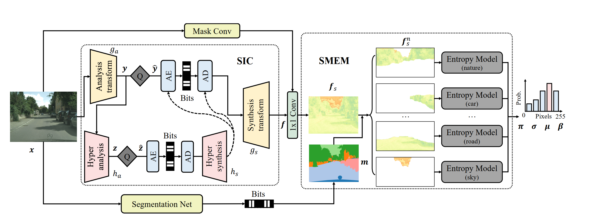

# SEEC: Segmentation-Assisted Multi-Entropy Models for Learned Lossless Image Compression
This repo is the official implementation of the paper "SEEC: Segmentation-Assisted Multi-Entropy Models for Learned Lossless Image Compression":

<div align="center">
  
</div>


## Preparation


### Installation

A suitable conda environment named seec can be created and train.py \
-- baactivated with:
```
conda create -n seec python=3.10
conda activate seec
pip install -r requirements.txt
```

### Dataset

Download the [DIV2K Train & Val HR dataset](https://data.vision.ee.ethz.ch/cvl/DIV2K/) and place it place it in your `DIV2K_TRAIN_PATH` and `DIV2K_VAL_PATH` respectively.

To prepare the dataset, run the following command, this will generate patches and mask images stored in `data` as default:
```
python prepare_data.py --div_path_train DIV2K_TRAIN_PATH --div_path_val DIV2K_VAL_PATH
```
### pre-trained models

We provide pre-trained models for various configurations, you can download from [PKU Disk](https://disk.pku.edu.cn/link/AAA236AE0BC42E4C8194AAAA96E9C290A1), [BaiDu NetDisk](https://pan.baidu.com/s/1CVc8pYoEkq1YKaMI0Mda8w?pwd=4nig), or [Google Drive](https://drive.google.com/drive/folders/1aylQL552EDCwdV6p1qD85KTwM97SH47l?usp=sharing).
| MEM (multi entrop model) | MCDLM (multi-channel lmm) | epoch |  md5 |  
|--------------------------|---------------------------|-------|---|
| ✔                        | ✔                         | 1500  |  9a3aedf9c7ae081c3477029db9519443 |  
| ✔                      | ✔                            | 600   |   e2d548cca0f7efa59ec94085d819a22b|  
| ✘                       | ✔                         | 600   |  3343a3e4f148ae232e32362ab841dcc7 |   
| ✔                        | ✘                        | 600   | 3b993700fb93d4117e5809fb6d7a3f6f  | 
| ✘                        | ✘                         | 600   |  e5e244b9e9868b804f707817be5f6053 |

Besides, you also need to download the pre-trained segmentation model from [BiRefNet](https://github.com/ZhengPeng7/BiRefNet), we use the [BiRefNet-general-epoch_244.pth](https://github.com/ZhengPeng7/BiRefNet/releases/download/v1/BiRefNet-general-epoch_244.pth) and place it in the `model_hub` directory.


## Usage
### Training from scratch
Example script for training the model from scratch, it takes about 5 days on a single NVIDIA A100 GPU:
```
python train.py \
-- batch_size 64 \
-- num_epochs 1500 \
-- lr 0.0001 \
-- aux_lr 0.001 \
-- train_path ./data/DIV2K_train_p128 \
-- val_path ./data/DIV2K_valid_p128 \
-- num_ch 192 \
-- prior_ch 256 \
-- context_ch 256 \
-- ep_ch 256 \
-- num_mix 5 \
```
use `--no_seg` to disable segmentation and `--no_multichannel_lmm` to disable multi-channel LMM.

### Evaluation
Given a model checkpoint, you can evaluate the negative log-likelihood (NLL) by dry-run:
```
python eval.py --ckpt PATH_TO_CHECKPOINT --imgdir PATH_TO_IMAGE_DIRECTORY --dryrun
```
or evaluate the actual bpp and runtime of compressing and decompressing the images:
```
python eval.py --ckpt PATH_TO_CHECKPOINT --imgdir PATH_TO_IMAGE_DIRECTORY
```
You can evaluate on multiple directories by specifying `--imgdir` multiple times:
```
python eval.py --ckpt PATH_TO_CHECKPOINT --imgdir PATH_TO_IMAGE_DIRECTORY_1 PATH_TO_IMAGE_DIRECTORY_2
```
## Citation


If you use our codebase, please consider also citing [DLPR](https://github.com/BYchao100/Deep-Lossy-Plus-Residual-Coding), [BiRefNet](https://github.com/ZhengPeng7/BiRefNet) and [L3C](https://github.com/fab-jul/L3C-PyTorch).

## Acknowledgment
This code is built on top of [CompressAI](https://github.com/InterDigitalInc/CompressAI). This repo refers the nn modules from [DLPR](https://github.com/BYchao100/Deep-Lossy-Plus-Residual-Coding), entropy coding from [torchac](https://github.com/fab-jul/torchac), segmentation network from [BiRefNet](https://github.com/ZhengPeng7/BiRefNet).